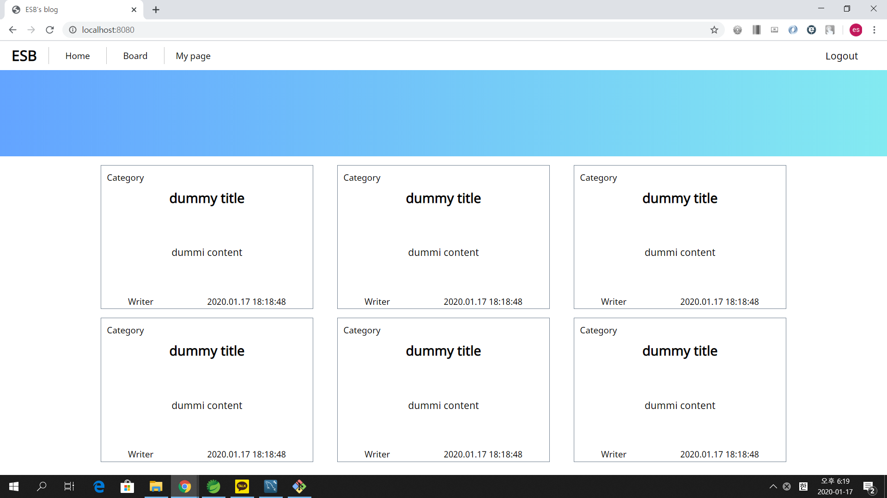
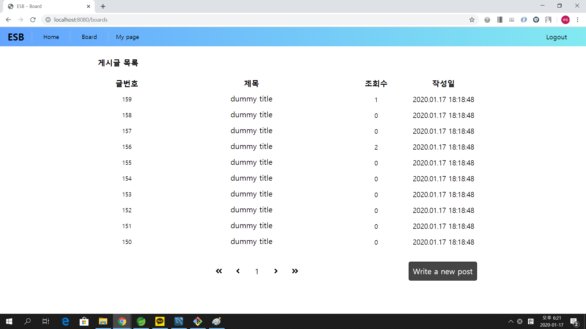
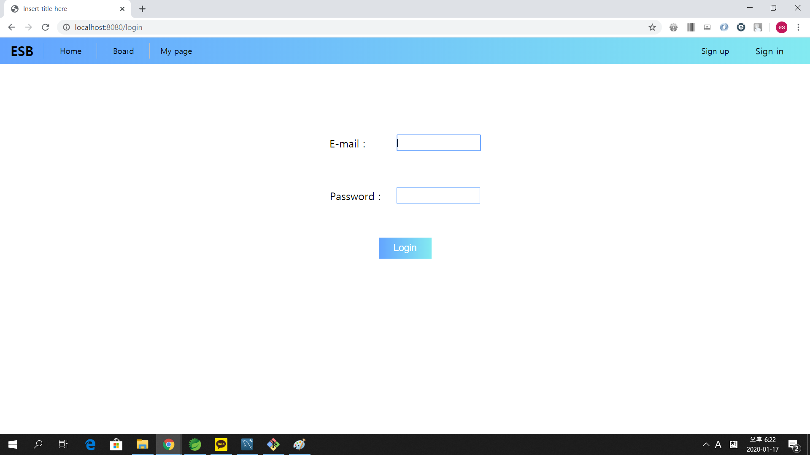
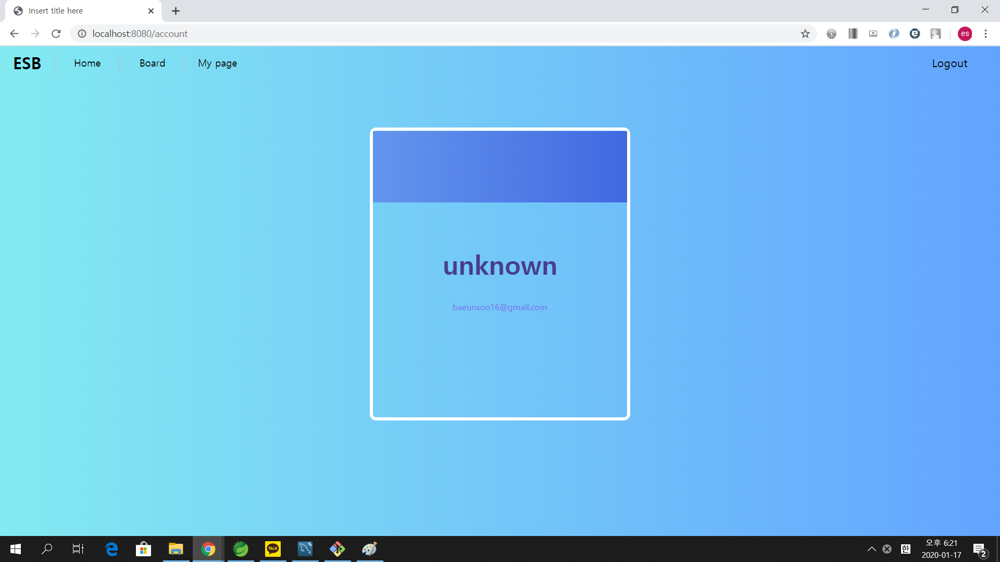
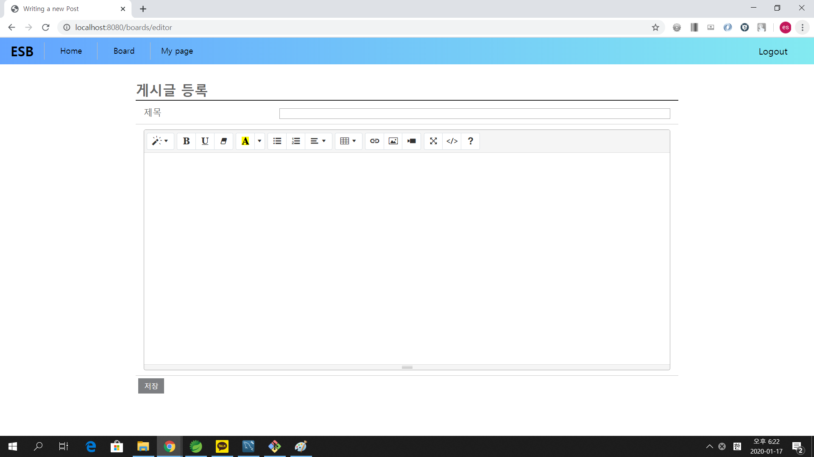
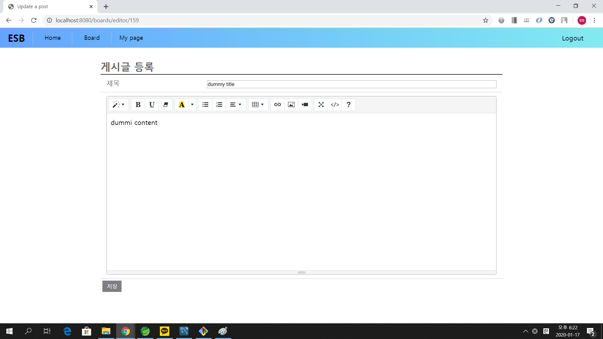
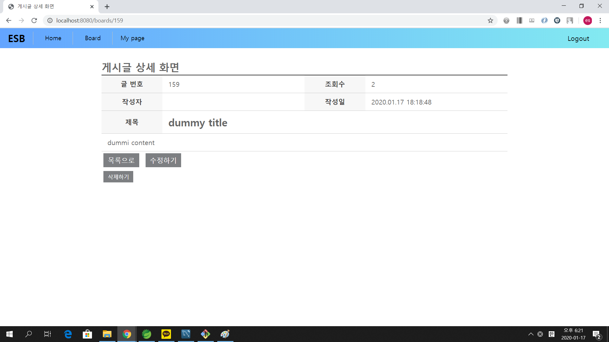

# 스프링 부트를 이용한 게시판 만들기

### Skills

IDE: STS 4

Spring boot 2.2.2, gradle

DB: MySQL(Mybatis 매퍼 사용)

Template Engine: Thmyeleaf

### 구현된 화면















### 실행방법

src/main/resources/application.properties 파일을 실행
```txt
spring.datasource.hikari.driver-class-name=com.mysql.cj.jdbc.Driver
spring.datasource.hikari.jdbc-url=<your-mysql-url>
spring.datasource.hikari.username=<your-mysql-username>
spring.datasource.hikari.password=<your-mysql_password>
spring.datasource.hikari.connection-test-query=SELECT 1
mybatis.configuration.map-underscore-to-camel-case=true
```
* jdbc-url, username, password를 자신의 로컬 mysql 정보에 맞게 각각 입력

MySQL workbench나 터미널에서 Board 테이블 생성
```sql
CREATE TABLE t_board (
  board_idx INT(11) NOT NULL AUTO_INCREMENT COMMENT '글 번호',
  title VARCHAR(300) NOT NULL COMMENT '제목',
  contents TEXT NOT NULL COMMENT '내용',
  hit_cnt SMALLINT(10) NOT NULL DEFAULT '0' COMMENT '조회수',
  created_datetime DATETIME NOT NULL COMMENT '작성시간',
  creator_id VARCHAR(50) NOT NULL COMMENT '작성자',
  updated_datetime DATETIME DEFAULT NULL COMMENT '수정시간',
  updater_id VARCHAR(50) DEFAULT NULL COMMENT '수정자',
  deleted_yn CHAR(1) NOT NULL DEFAULT 'N' COMMENT '삭제 여부',
  PRIMARY KEY (board_idx)
);
```

테스트용 Board 데이터 입력
```sql
INSERT INTO t_board
(
  title,
  contents,
  creator_id,
  created_datetime
)
VALUES
('dummy title','dummy content','admin',NOW()),
('dummy title','dummy content','admin',NOW()),
('dummy title','dummy content','admin',NOW()),
('dummy title','dummy content','admin',NOW()),
('dummy title','dummy content','admin',NOW()),
('dummy title','dummy content','admin',NOW()),
('dummy title','dummy content','admin',NOW()),
('dummy title','dummy content','admin',NOW()),
('dummy title','dummy content','admin',NOW()),
('dummy title','dummy content','admin',NOW()),
('dummy title','dummy content','admin',NOW()),
('dummy title','dummy content','admin',NOW()),
('dummy title','dummy content','admin',NOW()),
('dummy title','dummy content','admin',NOW()),
('dummy title','dummy content','admin',NOW()),
('dummy title','dummy content','admin',NOW()),
('dummy title','dummy content','admin',NOW()),
('dummy title','dummy content','admin',NOW()),
('dummy title','dummy content','admin',NOW()),
('dummy title','dummy content','admin',NOW()),
('dummy title','dummy content','admin',NOW()),
('dummy title','dummy content','admin',NOW()),
('dummy title','dummy content','admin',NOW()),
('dummy title','dummy content','admin',NOW()),
('dummy title','dummy content','admin',NOW()),
('dummy title','dummy content','admin',NOW()),
('dummy title','dummy content','admin',NOW());
```

MySQL workbench나 터미널에서 Member 테이블 생성
```sql
CREATE TABLE MEMBER (
  ID VARCHAR(20) PRIMARY KEY,
  PASSWORD VARCHAR(100) NOT NULL,
  NAME VARCHAR(30),
  ROLE VARCHAR(12),
  ENABLED BOOLEAN
);
```

Run -> BoardApplication.java 실행